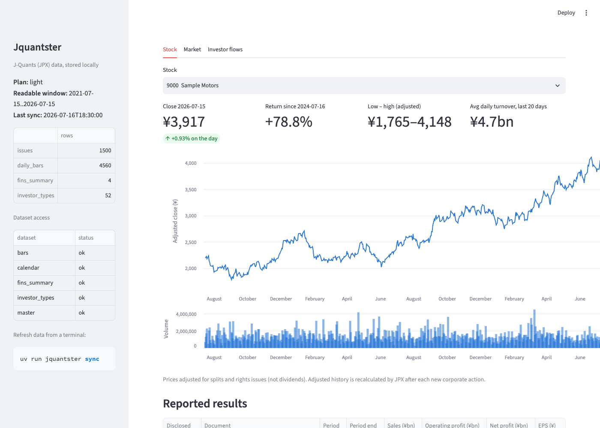
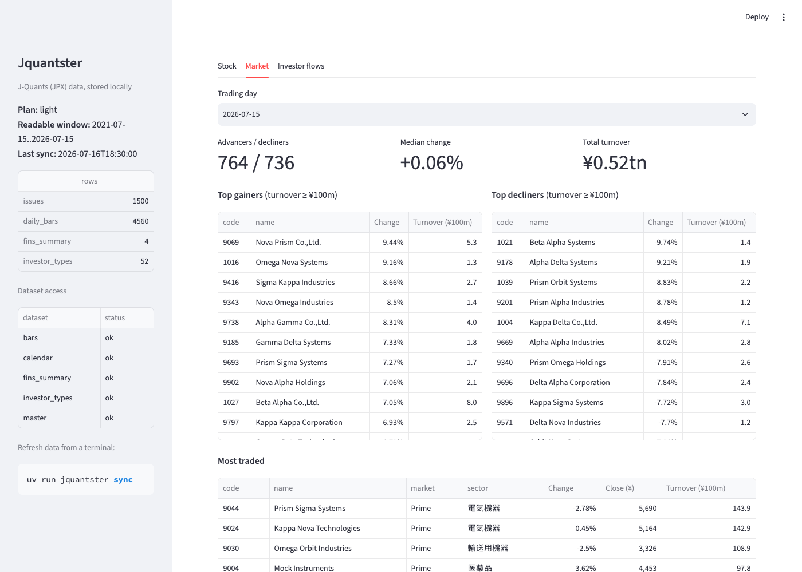
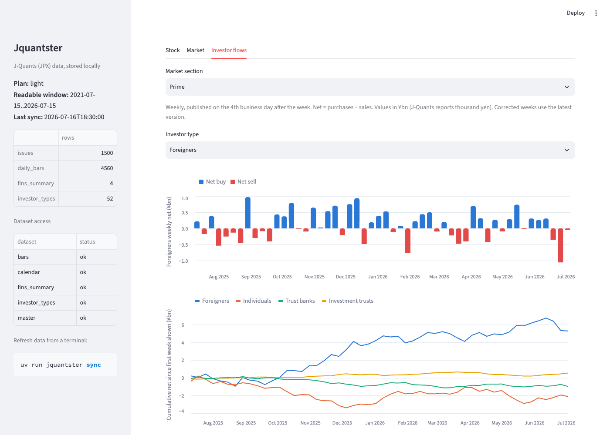

# jquantster

Fetches Japanese stock market data from [J-Quants](https://jpx-jquants.com/en), the official
API of Japan Exchange Group (JPX). It stays within your plan's rate limit, keeps the data in a
local SQLite file, and shows it in a small Streamlit dashboard.



<sub>Screenshots use synthetic sample data. J-Quants data may not be redistributed.</sub>

## What you get

| Tab | Shows | Plan |
|---|---|---|
| **Stock** | Adjusted price and volume history for your watchlist, plus reported quarterly results (sales, profit, EPS) | Free+ |
| **Market** | One trading day across all stocks: advancers and decliners, top movers, most traded | Free+ |
| **Investor flows** | Weekly net buying and selling by investor type (foreigners, individuals, trust banks and so on) per TSE section | Light+ |

| Market | Investor flows |
|---|---|
|  |  |

## Quick start

You need macOS or Linux, and a free J-Quants account:

1. Sign up at <https://jpx-jquants.com>.
2. In the dashboard, open **API Keys** and create a key.

```bash
git clone https://github.com/tomtomtomdev/jquantster && cd jquantster
./run.sh
```

`run.sh` does everything in one step:
1. Installs [uv](https://docs.astral.sh/uv/) if it's missing, then Python 3.12 and the dependencies.
2. On first run, asks for your API key (input hidden) and plan, and saves them to `.env`.
3. Syncs new data from J-Quants.
4. Opens the dashboard at <http://localhost:8510>.

Run it again any time: it only fetches what's new.

| Command | Does |
|---|---|
| `./run.sh` | Install if needed → sync → dashboard |
| `./run.sh --no-sync` | Dashboard only |
| `./run.sh --sync-only` | Sync and exit (for cron) |
| `JQUANTS_API_KEY=… JQUANTS_PLAN=light ./run.sh` | First-time setup without prompts |

## Configuration

Settings live in `.env`. The file is git-ignored and readable only by you. `.env.example`
is the template.

| Variable | Default | Meaning |
|---|---|---|
| `JQUANTS_API_KEY` | – | Your API key. Required. |
| `JQUANTS_PLAN` | `free` | `free`, `light`, `standard` or `premium`. Sets the rate limit and date window. |
| `JQUANTS_WATCHLIST` | `7203,6758,8306,9984,6861` | Stocks whose full history is fetched (4-digit TSE codes) |
| `JQUANTS_DB` | `data/jquantster.db` | SQLite file location |

## Commands

`run.sh` wraps these; you can also call them directly:

```bash
uv run jquantster sync                    # fetch new data
uv run jquantster sync --codes 7203,6758  # different stocks than the watchlist
uv run jquantster sync --market-days 5    # all stocks for the latest 5 trading days (default 2)
uv run jquantster status                  # row counts, last sync, dataset access
uv run jquantster ui                      # dashboard on :8510 (extra flags go to Streamlit,
                                          #   e.g. --server.port 8600)
```

## Plans and rate limits

| Plan | Price/month | Requests/min (used) | History | Delay | Investor flows |
|---|---|---|---|---|---|
| free | ¥0 | 5 (3) | 2 years | 12 weeks | – |
| light | ¥1,650 | 60 (48) | 5 years | none | ✓ |
| standard | ¥3,300 | 120 (96) | 10 years | none | ✓ |
| premium | ¥16,500 | 500 (400) | 20 years | none | ✓ |

The fetcher uses 80% of the published limit, and at most limit − 2 on small plans. Free still
returned a 429 at 4 requests a minute in practice.

- **One budget per account.** Every call is logged in SQLite, so separate processes share the
  same budget.
- **Financial statements have their own cap.** `/fins/*` is limited to 60 requests a minute on
  every plan, tracked separately.
- **After a 429, everything pauses for 2 minutes.** The API sends no `Retry-After` header, and
  repeated 429s get the account blocked for about 5 minutes.
- **Datasets outside your plan are skipped.** When the API says your plan doesn't include a
  dataset, the sync records that (see `jquantster status`) and carries on.
- **Free history counts back from the delay.** On Free, the 2 years end at the 12-week cutoff:
  run on 2026-10-07, it covers 2024-07-15 to 2026-07-15.

A first sync on Free with a 5-stock watchlist makes about 15 calls and takes about 5 minutes.
Later syncs are shorter.

## How it fetches

| Data | Calls |
|---|---|
| Watchlist prices and results | One request per stock returns its whole history |
| Market snapshot | One request per trading day returns every stock |
| Investor flows | One request for the whole range. Each sync re-reads the last 3 weeks, because JPX re-issues corrected weeks with a new publish date. |
| Calendar, stock list | One request each |

Each job resumes from what's already stored, and fills older gaps when the plan window moves.

### Daily automatic sync

```bash
./schedule.sh install          # weekdays at 18:45 Tokyo time, converted to your local time
./schedule.sh install 07:30    # or pick your own local time
./schedule.sh status           # schedule, last exit code, last run's output
./schedule.sh run              # run it now through the scheduler
./schedule.sh logs             # follow data/sync.log
./schedule.sh uninstall
```

- **macOS:** installs a launchd agent (`~/Library/LaunchAgents/dev.tomtomtomdev.jquantster.sync.plist`).
  A run missed while the Mac was asleep starts as soon as it wakes. A failed sync posts a
  macOS notification.
- **Linux:** adds a crontab entry instead.

The default time follows J-Quants' publishing schedule: daily prices around 16:30 JST, the
per-stock breakdown around 18:00 JST, and investor-type data on the 4th business day after
each week. On Free the data is 12 weeks old anyway, so any time works. The log rotates at about
1 MB.

## Data and storage

Everything lives in one SQLite file (`data/`, git-ignored):

| Table | Contents |
|---|---|
| `daily_bars` | Daily OHLC, volume, turnover, raw and split-adjusted |
| `issues` | Listed stocks: names, market, sector |
| `fins_summary` | Earnings summaries, full API record kept as JSON |
| `investor_types` | Weekly flows, every published version (`investor_types_latest` view = newest) |
| `calendar` | TSE trading days |
| `sync_log`, `entitlements`, `api_calls`, `meta` | Sync history, dataset access, rate-limit log |

Notes:
- Adjusted prices are recalculated by JPX after every new split, so old adjusted values change.
  Raw prices plus `adj_factor` are stored as well.
- Investor-type values are shown in ¥bn, on the assumption that J-Quants reports them in
  thousand yen, as JPX publishes them.
- J-Quants data is for your own use under its terms. Don't commit or publish the database.

## Troubleshooting

| Symptom | Fix |
|---|---|
| `Auth error: The incoming api key is invalid or expired` | Re-copy the key from the J-Quants dashboard into `.env`. |
| `investor_types not_in_plan` / `not_entitled` | That dataset needs a higher plan. Set `JQUANTS_PLAN` once you've upgraded. |
| `400 … Your subscription covers the following dates` | `JQUANTS_PLAN` doesn't match your real plan. |
| Market tab says it needs two trading days | Run `uv run jquantster sync --market-days 2`. |
| Port 8510 in use | Run `uv run jquantster ui --server.port 8600`. |
| Lots of `rate limit: waiting …` lines | Normal, especially on Free (3 calls a minute). |

## Project layout

```
run.sh                  one-step install / sync / dashboard
schedule.sh             daily auto-sync (launchd / cron)
src/jquantster/
  config.py             plans, limits, .env loading
  client.py             HTTP client + SQLite-backed rate limiter
  sync.py               one job per dataset, incremental
  db.py                 schema and upserts
  cli.py                `jquantster sync | status | ui`
  app.py                Streamlit dashboard
tests/                  run against a fake API, no key needed
```

## Development

```bash
uv sync
uv run pytest
```
