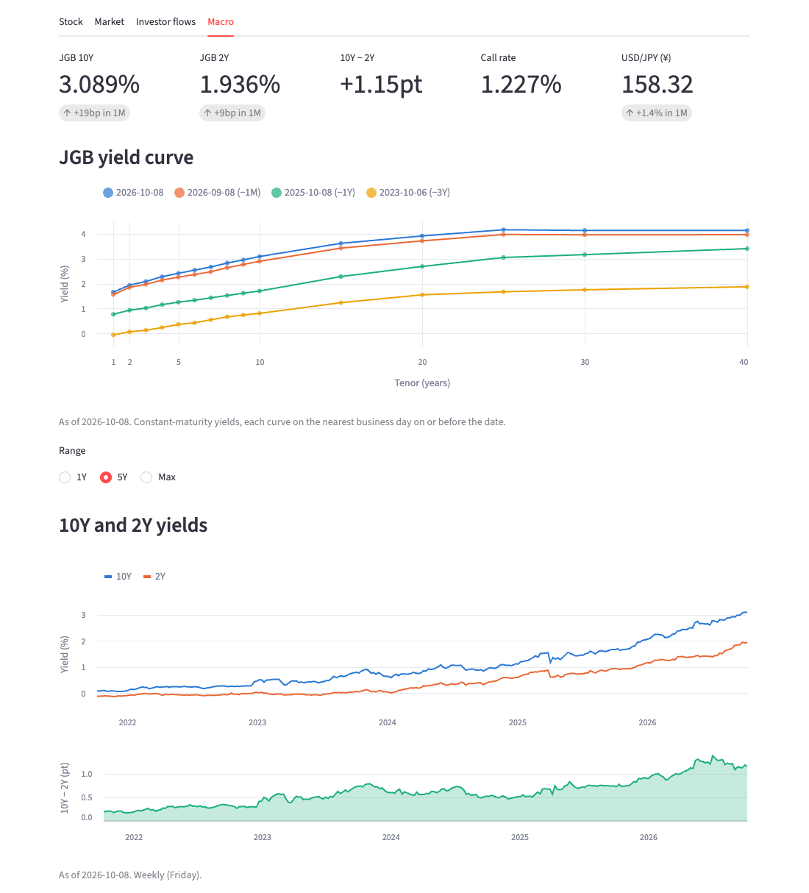

# jquantster

Fetches Japanese stock market data from [J-Quants](https://jpx-jquants.com/en), the official
API of Japan Exchange Group (JPX). It stays within your plan's rate limit, keeps the data in a
local SQLite file, and shows it in a small Streamlit dashboard.


<sub>Stock, Market and Investor flows screenshots use synthetic sample data: J-Quants data may not be redistributed. The Macro screenshot shows real MOF and BOJ data.</sub>

## What you get

| Tab | Shows | Plan |
|---|---|---|
| **Stock** | Adjusted price and volume history for your watchlist, plus reported quarterly results (sales, profit, EPS) | Free+ |
| **Stock** (EDINET) | Recent filings, large shareholders (5% reports) and balance sheet / cash flow by period | Free, [separate key](#edinet-optional) |
| **Market** | One trading day across all stocks: advancers and decliners, top movers, most traded | Free+ |
| **Investor flows** | Weekly net buying and selling by investor type (foreigners, individuals, trust banks and so on) per TSE section | Light+ |
| **Macro** | JGB yield curve, 10Y and 2Y yields, overnight call rate, USD/JPY and the BOJ Tankan | No key, [details](#macro-data) |

| Market | Investor flows |
|---|---|
|  |  |

## Quick start

You need macOS or Linux, and a free J-Quants account:

1. Sign up at <https://jpx-jquants.com>.
2. In the dashboard, open **API Keys** and create a key.

```bash
git clone https://github.com/tomtomtomdev/jquantster && cd jquantster
./run.sh
```

`run.sh` does everything in one step:
1. Installs [uv](https://docs.astral.sh/uv/) if it's missing, then Python 3.12 and the dependencies.
2. On first run, asks for your API key (input hidden) and plan, and an optional
   [EDINET](#edinet-optional) key, and saves them to `.env`.
3. Syncs new data from J-Quants.
4. Opens the dashboard at <http://localhost:8510>.

Run it again any time: it only fetches what's new.

| Command | Does |
|---|---|
| `./run.sh` | Install if needed → sync → dashboard |
| `./run.sh --no-sync` | Dashboard only |
| `./run.sh --sync-only` | Sync and exit (for cron) |
| `JQUANTS_API_KEY=… JQUANTS_PLAN=light EDINET_API_KEY=… ./run.sh` | First-time setup without prompts (the EDINET key is optional) |

## Configuration

Settings live in `.env`. The file is git-ignored and readable only by you. `.env.example`
is the template.

| Variable | Default | Meaning |
|---|---|---|
| `JQUANTS_API_KEY` | – | Your API key. Required. |
| `JQUANTS_PLAN` | `free` | `free`, `light`, `standard` or `premium`. Sets the rate limit and date window. |
| `JQUANTS_WATCHLIST` | `7203,6758,8306,9984,6861` | Stocks whose full history is fetched (4-digit TSE codes) |
| `JQUANTS_DB` | `data/jquantster.db` | SQLite file location |
| `EDINET_API_KEY` | – | Optional [EDINET](#edinet-optional) key. Empty: EDINET jobs are skipped. |
| `EDINET_HISTORY_DAYS` | `365` | Days of filings fetched on the first EDINET sync |
| `EDINET_SKIP` | – | `1` stops `run.sh` asking for an EDINET key. Written when you press Enter at that prompt. |
| `MACRO_ENABLED` | `1` | `0` turns off the [macro](#macro-data) jobs |
| `MACRO_HISTORY_START` | `2000-01-01` | Earliest date of JGB and BOJ data kept |

## EDINET (optional)

[EDINET](https://disclosure2.edinet-fsa.go.jp/) is the Financial Services Agency's filing
system: annual and semiannual securities reports, large-shareholding (5%) reports and more.
With a key, the Stock tab adds three sections below the reported results: recent filings by or
about the company, large shareholders with their ratio over time, and balance sheet and cash
flow figures by period.

1. Get a free key at <https://api.edinet-fsa.go.jp/api/auth/index.aspx?mode=1>.
2. Paste it when `run.sh` asks, or set `EDINET_API_KEY` in `.env`.

| | |
|---|---|
| Calls | EDINET lists filings by day, not by company, so the sync makes one call per business day, then filters locally. Each relevant report for a watchlist stock is one more download. |
| First sync | `EDINET_HISTORY_DAYS` (default 365) ≈ 260 calls at 50 a minute, about 5–6 minutes, plus the report downloads |
| Later syncs | A few calls: the last 3 days are re-read, then only new reports are downloaded |
| Rate limit | Not published; the fetcher stays near 1 request a second, budgeted separately from J-Quants |
| No key | The jobs are skipped (`set EDINET_API_KEY to enable`) and the dashboard says how to enable them |

EDINET is government open data, so the J-Quants redistribution caveat doesn't apply to it. See
EDINET's [terms of use](https://disclosure2dl.edinet-fsa.go.jp/guide/static/disclosure/WZEK0030.html)
for how it may be reused.

## Macro data

The Macro tab needs no key. It shows the latest JGB yield curve against 1 month, 1 year and 3
years earlier, 10Y and 2Y yields with the gap between them, the overnight call rate, USD/JPY and
the Bank of Japan's Tankan business conditions for large manufacturers and non-manufacturers,
including the next-quarter forecast. A range selector picks 1 year, 5 years or everything.



| | |
|---|---|
| Sources | [Ministry of Finance](https://www.mof.go.jp/english/policy/jgbs/reference/interest_rate/index.htm) JGB yield CSVs; [Bank of Japan](https://www.stat-search.boj.or.jp/) time-series API |
| First sync | 5 calls, under 15 seconds. MOF's full history file is about 1.2 MB; data before `MACRO_HISTORY_START` is dropped. |
| Later syncs | 4 calls: MOF's current-month file and one BOJ call per database. BOJ figures from the last month are re-read, because BOJ revises them. |
| Rate limit | Not published; the fetcher stays at 20 a minute, budgeted separately |
| Freshness | Yields, the call rate and USD/JPY lag a business day or two. The Tankan is published four times a year: early April, July and October, and mid-December. |

Both are government open data and may be reused with the source credited, which the tab does.

**Adding a BOJ series.** Find its code in the BOJ database listing, for example
<https://www.stat-search.boj.or.jp/api/v1/getMetadata?format=json&lang=en&db=FM08> for foreign
exchange. Then add a line to `BOJ_SERIES` in `src/jquantster/config.py`:

```python
"eurjpy": ("FM08", "FXERD31", "DAILY"),
```

The next sync stores it in `macro_obs` under that key. Showing it in the tab is up to you.

## Commands

`run.sh` wraps these; you can also call them directly:

```bash
uv run jquantster sync                    # fetch new data
uv run jquantster sync --codes 7203,6758  # different stocks than the watchlist
uv run jquantster sync --market-days 5    # all stocks for the latest 5 trading days (default 2)
uv run jquantster status                  # row counts, last sync, dataset access
uv run jquantster ui                      # dashboard on :8510 (extra flags go to Streamlit,
                                          #   e.g. --server.port 8600)
```

## Plans and rate limits

| Plan | Price/month | Requests/min (used) | History | Delay | Investor flows |
|---|---|---|---|---|---|
| free | ¥0 | 5 (3) | 2 years | 12 weeks | – |
| light | ¥1,650 | 60 (48) | 5 years | none | ✓ |
| standard | ¥3,300 | 120 (96) | 10 years | none | ✓ |
| premium | ¥16,500 | 500 (400) | 20 years | none | ✓ |

The fetcher uses 80% of the published limit, and at most limit − 2 on small plans. Free still
returned a 429 at 4 requests a minute in practice.

- **One budget per account.** Every call is logged in SQLite, so separate processes share the
  same budget.
- **Financial statements have their own cap.** `/fins/*` is limited to 60 requests a minute on
  every plan, tracked separately.
- **After a 429, everything pauses for 2 minutes.** The API sends no `Retry-After` header, and
  repeated 429s get the account blocked for about 5 minutes.
- **Datasets outside your plan are skipped.** When the API says your plan doesn't include a
  dataset, the sync records that (see `jquantster status`) and carries on.
- **Free history counts back from the delay.** On Free, the 2 years end at the 12-week cutoff:
  run on 2026-10-07, it covers 2024-07-15 to 2026-07-15.

A first sync on Free with a 5-stock watchlist makes about 15 calls and takes about 5 minutes.
Later syncs are shorter.

## How it fetches

| Data | Calls |
|---|---|
| Watchlist prices and results | One request per stock returns its whole history |
| Market snapshot | One request per trading day returns every stock |
| Investor flows | One request for the whole range. Each sync re-reads the last 3 weeks, because JPX re-issues corrected weeks with a new publish date. |
| Calendar, stock list | One request each |
| EDINET filings | One request per business day; one download per relevant report ([details](#edinet-optional)) |
| Macro | MOF's current-month CSV (plus the history file until it covers last month) and one BOJ request per database ([details](#macro-data)) |

Each job resumes from what's already stored, and fills older gaps when the plan window moves.

### Daily automatic sync

```bash
./schedule.sh install          # weekdays at 18:45 Tokyo time, converted to your local time
./schedule.sh install 07:30    # or pick your own local time
./schedule.sh status           # schedule, last exit code, last run's output
./schedule.sh run              # run it now through the scheduler
./schedule.sh logs             # follow data/sync.log
./schedule.sh uninstall
```

- **macOS:** installs a launchd agent (`~/Library/LaunchAgents/dev.tomtomtomdev.jquantster.sync.plist`).
  A run missed while the Mac was asleep starts as soon as it wakes. A failed sync posts a
  macOS notification.
- **Linux:** adds a crontab entry instead.

The default time follows J-Quants' publishing schedule: daily prices around 16:30 JST, the
per-stock breakdown around 18:00 JST, and investor-type data on the 4th business day after
each week. On Free the data is 12 weeks old anyway, so any time works. The log rotates at about
1 MB.

## Data and storage

Everything lives in one SQLite file (`data/`, git-ignored):

| Table | Contents |
|---|---|
| `daily_bars` | Daily OHLC, volume, turnover, raw and split-adjusted |
| `issues` | Listed stocks: names, market, sector |
| `fins_summary` | Earnings summaries, full API record kept as JSON |
| `investor_types` | Weekly flows, every published version (`investor_types_latest` view = newest) |
| `calendar` | TSE trading days |
| `edinet_docs` | EDINET filings index (`edinet_codes` view maps EDINET codes to stock codes) |
| `edinet_holdings` | Large-shareholding reports: holder, ratio, shares (`edinet_parsed` tracks parsed reports) |
| `edinet_fins` | Balance sheet and cash flow items per report (`edinet_fins_latest` view = newest per period) |
| `jgb_yields` | MOF JGB yields per date and tenor, in percent |
| `macro_series`, `macro_obs` | BOJ series (`BOJ_SERIES`) and their observations; quarterly ones dated at quarter end |
| `sync_log`, `entitlements`, `api_calls`, `meta` | Sync history, dataset access, rate-limit log |

Notes:
- Adjusted prices are recalculated by JPX after every new split, so old adjusted values change.
  Raw prices plus `adj_factor` are stored as well.
- Investor-type values are shown in ¥bn, on the assumption that J-Quants reports them in
  thousand yen, as JPX publishes them.
- J-Quants data is for your own use under its terms. Don't commit or publish the database.
- EDINET figures are taken from the XBRL-converted CSVs: consolidated where reported, otherwise
  non-consolidated (the dashboard shows which).

## Troubleshooting

| Symptom | Fix |
|---|---|
| `Auth error: The incoming api key is invalid or expired` | Re-copy the key from the J-Quants dashboard into `.env`. |
| `investor_types not_in_plan` / `not_entitled` | That dataset needs a higher plan. Set `JQUANTS_PLAN` once you've upgraded. |
| `400 … Your subscription covers the following dates` | `JQUANTS_PLAN` doesn't match your real plan. |
| Market tab says it needs two trading days | Run `uv run jquantster sync --market-days 2`. |
| Port 8510 in use | Run `uv run jquantster ui --server.port 8600`. |
| Lots of `rate limit: waiting …` lines | Normal, especially on Free (3 calls a minute). |
| `jquantster status` lists `edinet  auth_error` | The EDINET key was rejected. Re-copy it into `EDINET_API_KEY` in `.env`. |
| Stock tab shows a box about EDINET instead of filings | No `EDINET_API_KEY` set, or no sync since adding it. Add the key and run a sync. |
| `macro boj` fails with `Nonexistent series code` | A code in `BOJ_SERIES` is wrong or was retired. Check it against the BOJ metadata listing. |
| Macro tab says there's no data | Run a sync, and check `MACRO_ENABLED` isn't `0`. |

## Project layout

```
run.sh                  one-step install / sync / dashboard
schedule.sh             daily auto-sync (launchd / cron)
src/jquantster/
  config.py             plans, limits, .env loading
  client.py             HTTP client + SQLite-backed rate limiter
  edinet.py             EDINET client and CSV parsing
  macro.py              MOF JGB CSV and BOJ API client
  sync.py               one job per dataset, incremental
  db.py                 schema and upserts
  cli.py                `jquantster sync | status | ui`
  app.py                Streamlit dashboard
tests/                  run against a fake API, no key needed
```

## Development

```bash
uv sync
uv run pytest
```
